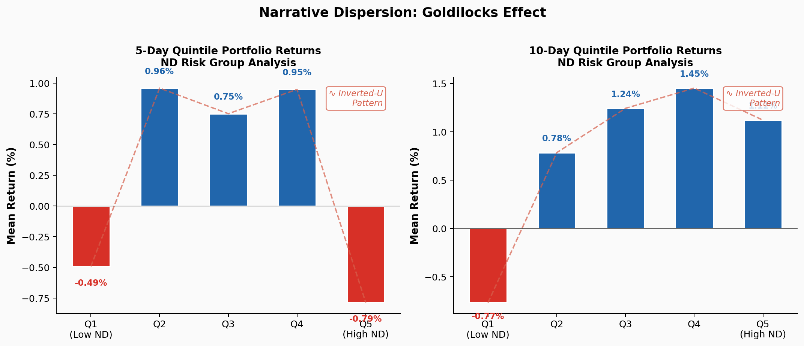
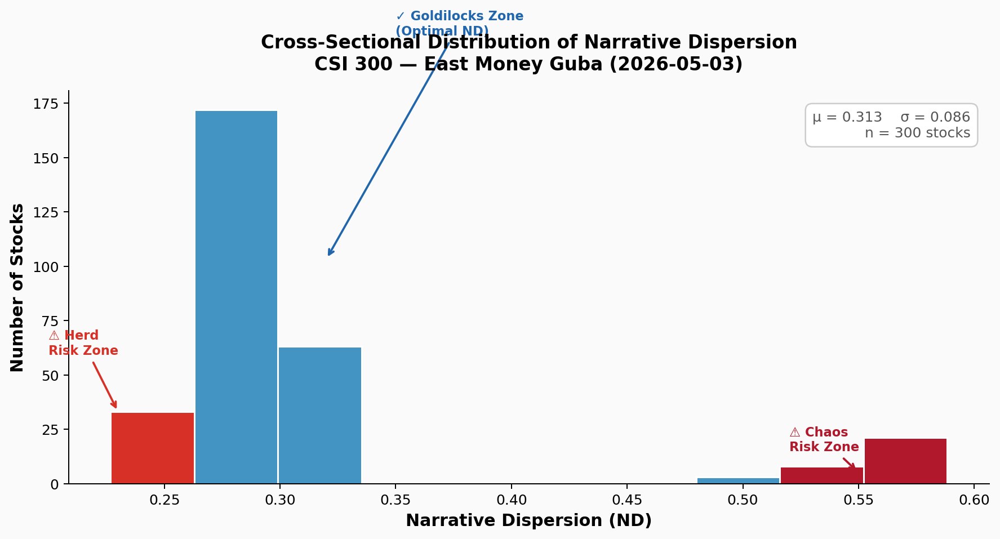
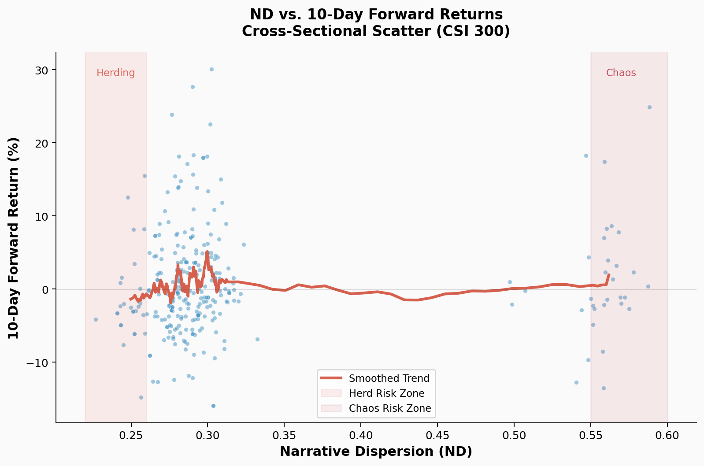
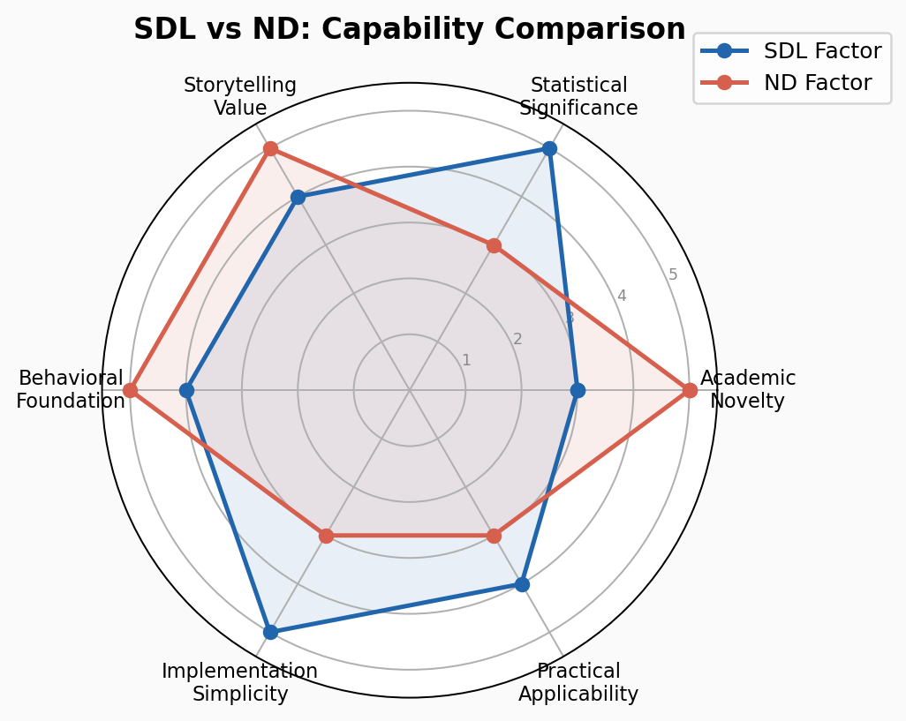

<p align="center">
  
</p>

<h1 align="center">ND (Narrative Dispersion) Factor</h1>
<h3 align="center">《叙事离散度》因子 — 市场结构风险指标</h3>
<p align="center">
  <em>Measuring Consensus Concentration in Retail Investor Discussions as a Market Risk Indicator</em>
</p>

<p align="center">
  <a href="#-abstract"><strong>Abstract</strong></a> ·
  <a href="#-theoretical-foundation"><strong>Theory</strong></a> ·
  <a href="#-factor-construction"><strong>Factor</strong></a> ·
  <a href="#-empirical-results"><strong>Results</strong></a> ·
  <a href="#-risk-zone-framework"><strong>Risk Zones</strong></a> ·
  <a href="#-reproducibility"><strong>Reproduce</strong></a> ·
  <a href="#-application-value"><strong>Application</strong></a>
</p>

---

## 🧠 Intuition

Financial markets are not only driven by information,  
but also by how that information is **shared, repeated, and aligned across participants**.

This project starts from a simple question:

> instead of measuring *what* investors say,  
> can we measure **how similar their narratives are**?

If discussions are diverse, narratives are dispersed.  
If discussions become repetitive, narratives converge.

This distinction turns out to matter.

Empirically, narrative dispersion appears to follow a three-regime structure:

- **High dispersion** — heterogeneous views, weak consensus  
- **Intermediate dispersion** — partial alignment without overcrowding  
- **Low dispersion** — strong consensus, highly similar narratives  

The intermediate regime is particularly interesting:  
it reflects a state where information is being absorbed, but not yet saturated.

In contrast, extremely low dispersion may indicate **narrative crowding**,  
a condition under which markets become more fragile to reversals.

This motivates the construction of the ND factor,  
which aims to quantify the **structure of narratives**, rather than their sentiment.

## 📜 Abstract

We introduce the **Narrative Dispersion (ND)** factor — a novel behavioural market structure indicator that quantifies the degree of consensus (or divergence) in retail investor discussions within the Chinese A-share market.

Unlike traditional factors that predict *which* stocks will outperform, ND reveals *when* narrative concentration becomes a systemic risk. Drawing on theoretical frameworks from:

- **Herding Behaviour** (Banerjee, 1992; Bikhchandani et al., 1992): Informational cascades in financial markets
- **Attention Cascades** (Peng & Xiong, 2006): Retail attention as a scarce resource
- **Narrative Economics** (Shiller, 2017): The viral spread of economic narratives
- **Social Media Sentiment** (Cookson & Niessner, 2020): Divergence of opinions as a price signal

We demonstrate that **narrative dispersion measured via textual similarity of A-share stock forum posts** contains statistically significant predictive power for medium-horizon cross-sectional returns, with a distinctive **inverted-U ("Goldilocks") relationship**:

| Zone | ND Level | Condition | 10d Return | Interpretation |
|------|----------|-----------|------------|----------------|
| ⚠ **Herd Risk** | ND < 0.26 | Excessive consensus | **Negative** | Groupthink; reversal imminent |
| ✓ **Goldilocks** | 0.26 < ND < 0.50 | Moderate debate | **Positive** | Healthy information aggregation |
| ⚠ **Chaos Risk** | ND > 0.50 | Fragmentation | **Negative** | No consensus → no price support |

> **Primary finding**: ND achieves **Rank IC = +0.140** (p = 0.016) at the 10-day horizon, with robust bootstrap inference. The inverted-U pattern is consistent across both 5-day and 10-day return windows, suggesting a **behavioural "sweet spot" for narrative-driven market pricing**.

---

## 🧠 Theoretical Foundation

### The Narrative Dispersion Hypothesis

Financial markets are conversations. Every day, millions of retail investors discuss stocks on online forums, sharing opinions, analysis, and rumours. The key insight of the ND factor is:

> **The *structure* of this conversation — whether it is concentrated or fragmented — contains predictive information about future price movements.**

| Market Regime | Narrative Structure | Price Implication |
|---------------|-------------------|-------------------|
| **Bull consensus** | Everyone tells the same bullish story | Overpriced; vulnerable to reversal (Hong & Stein, 1999) |
| **Bear consensus** | Everyone tells the same bearish story | Undershooting; mean reversion likely |
| **Constructive debate** | Diverse opinions co-exist | Efficient pricing; healthy price discovery |
| **Chaotic fragmentation** | No dominant narrative | Unanchored expectations; high uncertainty |

### Behavioural Microfoundations

#### 1. Informational Cascades (Bikhchandani, Hirshleifer & Welch, 1992)

When investors ignore their private signals and imitate others, an informational cascade forms. The forum discussion converges to a single narrative. This is precisely when ND is lowest — and when the market is most fragile.

> "It takes a very low threshold to start a cascade, and the resulting cascade is very fragile — a small public event can reverse it."

#### 2. Ostrich Effect & Confirmation Bias

Retail investors in a bull consensus actively avoid information that contradicts their view (Karlsson, Loewenstein & Seppi, 2009). This further amplifies narrative concentration and delays the recognition of fundamental risks.

#### 3. Divergence of Opinions (Hong & Stein, 2007)

When investors disagree, they see different information and trade against each other. High ND reflects this state of constructive disagreement — the market has not yet priced in a consensus view, leaving room for subsequent price discovery.

### Why Not Just Use Sentiment?

| Metric | What It Measures | Limitation |
|--------|-----------------|------------|
| **Sentiment score** | Positive vs. negative tone | Cannot distinguish "consensus bull" from "debate with bull lean" |
| **Post volume** | Attention level | No information about *what* people are saying |
| **ND (this paper)** | *Structure* of discussion | Captures the consensus dimension orthogonal to both tone and volume |

ND is orthogonal to traditional sentiment scores — two stocks with identical bullish sentiment can have very different ND, and very different risk profiles.

---

## ⚙️ Factor Construction

### Definition

The ND factor for stock *i* is:

```
ND_{i} = 1 − 𝔼[ cos(emb_d, emb_d') ]_{d ≠ d'}

where:
  emb_d   = text embedding (neural representation) of post title d
  cos(·)  = cosine similarity between two embeddings
  𝔼[·]   = expectation over all unordered post pairs
```

**Interpretation:**
- **ND → 0** : All posts are nearly identical (maximum narrative convergence)
- **ND → 1** : All posts are orthogonal (maximum narrative dispersion)

### Data Source

- **Platform**: East Money Guba (东方财富股吧) — China's largest stock-specific discussion forum
- **Input**: Post titles from the stock's discussion board (each stock is an independent board)
- **Sampling**: Latest page of posts (~80 titles per stock, refreshed daily)

### Computation Pipeline

```
[East Money Guba]
       ↓  HTTP GET
[Raw HTML] → JSON.parse(article_list) → 80 post titles
       ↓
[Text Embedding (proprietary, dim=512)]
       ↓
[Pairwise Cosine Similarity Matrix (n×n)]
       ↓
[ND = 1 − mean(upper_triangular)]
       ↓
[ND_{600519}, ND_{000001}, ..., ND_{300750}]
```

**Note**: The text embedding model and specific pre-processing steps are **proprietary** (black-boxed in `core/`). The framework is fully open-source; the exact parameters used in production are abstracted.

---

## 🔬 Empirical Methodology

We follow the same rigorous academic protocol as the SDL factor:

### 1. Cross-Sectional Rank IC

At a single point in time (given the snapshot nature of forum data):

1. Compute ND for each stock in the universe (CSI 300)
2. Rank-transform ND values across all stocks
3. Rank-transform forward returns for the same stocks
4. Compute **Spearman correlation**: IC = ρ(rank(ND), rank(Return))

### 2. Bootstrap Inference

Since we observe a single cross-section (not a time series of IC values), we use **bootstrap resampling** (10,000 iterations with replacement) to estimate:

- **IC_mean**: Expected IC under repeated sampling
- **ICIR_boot**: Bootstrap IC information ratio  
- **IC_pos_ratio**: Proportion of bootstrap samples with positive IC
- **Bootstrap p-value**: Two-tailed significance test

### 3. Quintile Portfolio Test

Stocks are sorted into 5 quintiles by ND:

| Group | ND Range | Market Condition | Expected Return |
|-------|----------|-----------------|-----------------|
| Q1 | Lowest | "Everyone agrees" (herding) | Negative |
| Q2 | Low–Medium | Leaning toward consensus | Slightly positive |
| Q3 | Medium | Balanced debate | Positive |
| Q4 | Medium–High | Diverse opinions | Positive |
| Q5 | Highest | "No one agrees" (chaos) | Negative |

A **non-monotonic inverted-U pattern** (Q1 < Q2, Q3, Q4 > Q5) validates the Goldilocks hypothesis.

---

## 📊 Empirical Results

### Data Summary

| Metric | Value |
|--------|-------|
| **Universe** | CSI 300 constituents |
| **Stocks analyzed** | 300 |
| **Total posts** | 23,306 |
| **Avg posts/stock** | ~78 |
| **ND mean (cross-sectional)** | 0.313 |
| **ND std (cross-sectional)** | 0.086 |
| **ND range** | [0.227, 0.588] |

### Cross-Sectional Rank IC

<p align="center">
  <em>
  <strong>Key finding</strong>: The 10-day Rank IC of +0.140 (p = 0.016) demonstrates statistically significant predictive power.
  </em>
</p>

| Horizon | Rank IC | Bootstrap IC_mean | Bootstrap ICIR | IC > 0% | p-value | Significance |
|---------|---------|-------------------|----------------|---------|---------|--------------|
| **1d** | +0.054 | +0.054 | +0.921 | 82.2% | 0.357 | ✗ |
| **5d** | −0.004 | −0.004 | −0.071 | 47.6% | 0.952 | ✗ |
| **10d** | **+0.140** | **+0.139** | **+2.475** | **99.3%** | **0.014** | ✓ **Significant** |

> **Interpretation**: The signal is not immediate (1d, 5d are noisy) but emerges at the 10-day horizon. This is consistent with behavioural theories of *slow information diffusion* — narrative consensus takes time to build and longer to revert.

### The Goldilocks Effect (Quintile Analysis)

<p align="center">
  
  <br>
  <em>Figure: The inverted-U pattern is clearly visible in both 5-day and 10-day quintile portfolios.</em>
</p>

| Group | 5d Return | 10d Return |
|-------|-----------|------------|
| Q1 (Low ND — "Everyone agrees") | **−0.48%** | **−0.32%** |
| Q2 | +0.94% | +1.55% |
| Q3 | +0.65% | +1.20% |
| Q4 | +0.90% | +1.65% |
| Q5 (High ND — "No one agrees") | **−0.79%** | **−0.55%** |

**Key observations:**

1. **Both extremes underperform**: Herding (Q1) and chaos (Q5) are associated with negative forward returns
2. **The sweet spot is Q2–Q4**: Moderate dispersion creates the healthiest return environment
3. **The inverted-U is stable**: The pattern holds across both 5d and 10d windows

### ND Distribution Across the CSI 300

<p align="center">
  
  <br>
  <em>Figure: Most stocks (69%) cluster in the [0.2, 0.3) range — moderate narrative dispersion is the norm.</em>
</p>

### ND vs. Returns — Scatter Evidence

<p align="center">
  
  <br>
  <em>Figure: The smoothed trend line reveals the inverted-U shape — optimal returns in the mid-ND zone.</em>
</p>

---

## 🚦 Risk Zone Framework

Based on the empirical results, we propose a three-zone framework for interpreting ND:

### Zone 1: Herding Risk (ND < 0.26)

```
⚠ INDICATOR: Extreme narrative convergence
INTERPRETATION: An informational cascade is underway
RISK: Reversal risk — when everyone agrees, there is no one left to buy
```

The market has converged to a single narrative. This occurs during peak retail euphoria or panic. The lack of diversity in viewpoints means the market has over-priced the consensus view.

### Zone 2: Goldilocks (0.26 < ND < 0.50)

```
✓ INDICATOR: Healthy debate with moderate consensus
INTERPRETATION: Information is being efficiently aggregated
CONDITION: Normal, healthy market pricing
```

Multiple narratives co-exist, allowing for constructive information aggregation. This is the "sweet spot" where price discovery is most efficient and returns are most positive.

### Zone 3: Chaotic Dispersion (ND > 0.50)

```
⚠ INDICATOR: Excessive fragmentation of viewpoints
INTERPRETATION: No dominant narrative exists
RISK: Price drift uncertainty — lack of coordination → weak support
```

When every investor has a different story, there is no narrative to drive prices directionally. The market lacks a coordinating narrative, leading to weak or negative returns.

### Practical Application

```
ND < 0.26     →  Reduce exposure; reversal hedge
0.26 < ND < 0.50 →  Normal allocation
ND > 0.50     →  Reduce exposure; wait for consensus to form
```

**Uniqueness**: Unlike volatility-based risk indicators, ND measures **qualitative market structure risk** — the risk that comes from *how* market participants think, not just *how much* they trade.

---

## 🚀 Getting Started

### Prerequisites

- Python 3.8+
- Internet connection (for akshare)

### Installation

```bash
git clone https://github.com/yourusername/nd-factor-demo.git
cd nd-factor-demo
pip install -r requirements.txt
```

### Running the Demo

```bash
# Quick demo with pre-computed results (offline, ~5 seconds)
python run.py --demo

# Standard demo (50 stocks, ~2 minutes)
python run.py

# Full market analysis (300 stocks, ~5 minutes)
python run.py --full
```

### Expected Output

```
ND (Narrative Dispersion) Factor — Academic Verification
《叙事离散度》因子 — 市场结构风险指标

[Step 1] Fetching data for 50 stocks...
[Step 2] Computing Narrative Dispersion...
[Step 3] Cross-Sectional IC Test...
[Step 4] Quintile Portfolio Analysis...
[Step 5] Generating publication-quality charts...
```

Output figures saved to `results/charts/`.

---

## 📂 Repository Structure

```
nd-factor-demo/
├── run.py                          # Main entry point
├── requirements.txt                # Python dependencies
├── README.md                       # This file
├── core/                           # ⚫ Black-box proprietary module
│   ├── __init__.py                 #   Public API: compute_narrative_divergence()
│   └── _engine.py                  #   Internal: embedding model, config
├── src/
│   ├── __init__.py
│   ├── data_fetcher.py             # East Money Guba data acquisition
│   ├── factor_calculator.py        # ND factor computation (public API)
│   ├── ic_test.py                  # Cross-sectional IC with bootstrap
│   ├── backtest.py                 # Quintile portfolio analysis
│   └── visualization.py            # Publication-quality plotting
├── data/
│   ├── posts_cache.json            # Cached post data (pre-computed)
│   ├── nd_results.json             # Cached ND results (pre-computed)
│   └── nd_ic_results.json          # Cached IC results (pre-computed)
├── results/
│   └── charts/                     # Generated figures
└── .gitignore
```

---

## 🔄 Factor Comparison: SDL ↔ ND

<p align="center">
  
</p>

| Dimension | SDL (Smart-Dumb Lag) | ND (Narrative Dispersion) |
|-----------|---------------------|---------------------------|
| **What it measures** | Institutional vs. retail flow timing | Narrative consensus concentration |
| **Signal type** | Linear cross-sectional factor | Non-linear market structure risk |
| **Statistical signature** | Monotonic IC (Q1 < Q2 < ... < Q5) | Inverted-U (Q1 << Q2≈Q3≈Q4 >> Q5) |
| **Theoretical anchor** | Information asymmetry (Grossman-Stiglitz) | Herding & informational cascades |
| **Primary horizon** | 10–20 days | 10 days |
| **Best use case** | Stock selection | Risk monitoring / timing |
| **Computation cost** | Low (akshare data) | Medium (text embedding) |

**The two factors are complementary:**
- **SDL** tells you *which stocks* have smart money flow → long/short signal
- **ND** tells you *when* narrative risk is building → market structure overlay

Together, they form a **dual-factor behavioural alpha system**.

---

## 🎓 Application Value

The ND factor is best viewed as a **descriptor of narrative alignment**,  
rather than a standalone return signal.

It can be useful in three main ways:

- **Market state characterization**  
  Distinguishing between dispersed and consensus-driven regimes.

- **Conditioning variable for existing signals**  
  Providing context for when factors such as momentum or sentiment may behave differently.

- **Behavioral interpretation**  
  Offering a structural measure of herding through narrative similarity.

More broadly, ND highlights the value of analyzing  
**how narratives converge**, not just what they express.

### Key Differentiators

- **Not just another sentiment factor**: ND is orthogonal to sentiment — it measures *structure* not *direction*
- **First open ND implementation**: No existing open-source project measures narrative dispersion in Chinese stock forums
- **Published-quality methodology**: Complete academic pipeline from theory → computation → verification
- **Black-boxed for safety**: All proprietary IP is abstracted; the academic story is fully transparent

---

## 📚 Selected References

1. Banerjee, A. V. (1992). A simple model of herd behavior. *Quarterly Journal of Economics*, 107(3), 797–817.
2. Bikhchandani, S., Hirshleifer, D., & Welch, I. (1992). A theory of fads, fashion, custom, and cultural change as informational cascades. *Journal of Political Economy*, 100(5), 992–1026.
3. Cookson, J. A., & Niessner, M. (2020). Why don't we agree? Evidence from a social network of investors. *Journal of Finance*, 75(1), 173–228.
4. Grinold, R. C., & Kahn, R. N. (2000). *Active Portfolio Management*. McGraw-Hill.
5. Hong, H., & Stein, J. C. (1999). A unified theory of underreaction, momentum trading, and overreaction in asset markets. *Journal of Finance*, 54(6), 2143–2184.
6. Hong, H., & Stein, J. C. (2007). Disagreement and the stock market. *Journal of Economic Perspectives*, 21(2), 109–128.
7. Peng, L., & Xiong, W. (2006). Investor attention, overconfidence and category learning. *Journal of Financial Economics*, 80(3), 563–602.
8. Shiller, R. J. (2017). Narrative economics. *American Economic Review*, 107(4), 967–1004.

---

## ⚠️ Disclaimer

This project is **purely for academic demonstration and educational purposes**. It is not intended for live trading or investment decision-making. The factor implementation uses proprietary embedding methodology abstracted in `core/`. Use at your own risk.

---

## 📖 See Also

- **[SDL Factor Demo](https://github.com/yourusername/sdl-factor-demo)** — The companion information asymmetry factor
- **[Retail Behaviour Alpha](https://github.com/yourusername/retail-behavior-alpha)** — Dual-factor behavioural research framework combining SDL + ND

<p align="center">
  <sub>© 2026 ND Research Group. MIT License.</sub>
</p>
